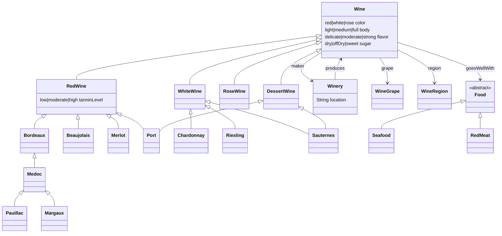

```mermaid
classDiagram
  class Wine {
    red|white|rose color
    light|medium|full body
    delicate|moderate|strong flavor
    dry|offDry|sweet sugar
  }
  class RedWine {
    low|moderate|high tanninLevel
  }
  class WhiteWine {
  }
  class RoseWine {
  }
  class DessertWine {
  }
  class Bordeaux {
  }
  class Medoc {
  }
  class Pauillac {
  }
  class Margaux {
  }
  class Beaujolais {
  }
  class Merlot {
  }
  class Port {
  }
  class Chardonnay {
  }
  class Riesling {
  }
  class Sauternes {
  }
  class Winery {
    String location
  }
  class WineGrape {
  }
  class WineRegion {
  }
  class Food {
    <<abstract>>
  }
  class Seafood {
  }
  class RedMeat {
  }
  Wine <|-- RedWine
  Wine <|-- WhiteWine
  Wine <|-- RoseWine
  Wine <|-- DessertWine
  RedWine <|-- Bordeaux
  Bordeaux <|-- Medoc
  Medoc <|-- Pauillac
  Medoc <|-- Margaux
  RedWine <|-- Beaujolais
  RedWine <|-- Merlot
  RedWine <|-- Port
  DessertWine <|-- Port
  WhiteWine <|-- Chardonnay
  WhiteWine <|-- Riesling
  WhiteWine <|-- Sauternes
  DessertWine <|-- Sauternes
  Food <|-- Seafood
  Food <|-- RedMeat
  Wine --> Winery : maker
  Winery --> Wine : produces
  Wine --> WineGrape : grape
  Wine --> WineRegion : region
  Wine --> Food : goesWellWith
```

Disjoint: RedWine ⟂ WhiteWine · RedWine ⟂ RoseWine · WhiteWine ⟂ RoseWine · Chardonnay ⟂ Riesling · Seafood ⟂ RedMeat
